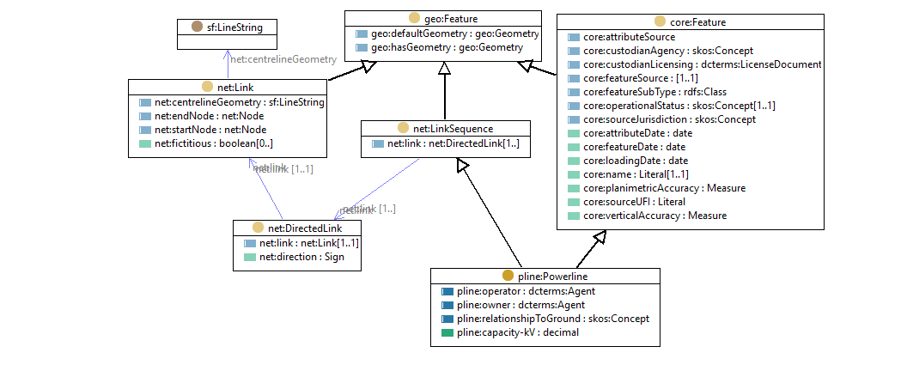

# FSDF Powerline model

The [FSDF Powerline](./rdf/powerline.ttl) is an [FSDF (core) Feature](https://github.com/GeoscienceAustralia/FSDF/blob/master/core.md) and [LinkSequence](https://github.com/GeoscienceAustralia/FSDF/blob/master/network.md)

 

The additional properties are taken from [Powerlines.xlsx](Powerlines.xlsx)
